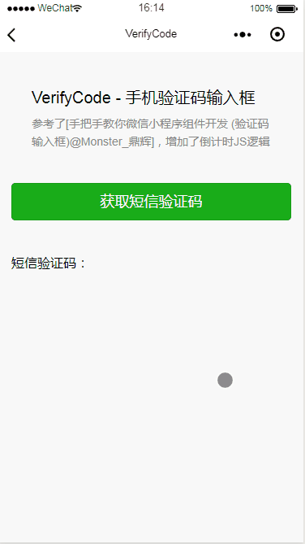

## VerifyCode - 手机验证码输入框

## 组件介绍
参考了[手把手教你微信小程序组件开发 (验证码输入框)@Monster_鼎辉](https://www.jianshu.com/p/c3695b3415ba)，增加了倒计时JS逻辑。



## 使用方法

导入`src/components`中的`verifyCode`文件夹，在需要使用该组件的页面 `index.json` 中引入。

```json
{
  "usingComponents": {
    "verifyCode": "/components/verifyCode/index"
  },
  "navigationBarTitleText": "VerifyCode"
}
```
引用组件标签
* column: 左上角标题
* title：正文
* content： 返回提示

```html
<view class="page">
  <!-- 验证码组件 -->
  <verifyCode id='verifycode' column="绑卡并支付" title="请输入短信验证码" content="验证码已发送至您手机"/>
</view>
```

页面调用方法

```js
Page({
  data: {
    
  },
  onLoad: function () {
    // 选择组件对象
    this.verifycode = this.selectComponent("#verifycode");
  },

  start() {
    // 弹出组件
    var _this = this;
    wx.showLoading({
      title: '加载中',
    })
    setTimeout(() => {
      _this.verifycode.showView({
        phone: "13800000000",   // 修改手机号码
        inputSuccess: function (phoneCode) {
          // 调用组件关闭方法
          _this.verifycode.closeView();
          // 设置数据
          _this.setData({
            code: phoneCode     // 获取输入的手机验证码
          });
          wx.showLoading({
            title: '加载中',
          })
          setTimeout(() => {
            wx.hideLoading()
            wx.showToast({
              title: '提交成功',
            })
          }, 1000)
        }
      });
    }, 800)
  }
})
```