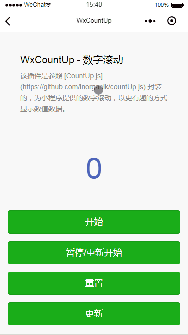

## WxCountUp - 数字滚动

## 插件介绍
该插件是参照 [CountUp.js](https://github.com/inorganik/countUp.js) 封装的，为小程序提供的数字滚动，以更有趣的方式显示数值数据。



## 参数说明

### Params

| 参数 | 类型 | 描述 |
| --- | --- | --- |
| target | <code>String</code> | 滚动对象 |
| endVal | <code>Number</code> | 滚动结束时的数字 |
| options | <code>Object</code> | 配置 |
| context | <code>Object</code> | 微信小程序当前this对象，`必填` |

### Options （非必填项）

| 参数 | 类型 | 描述 |
| --- | --- | --- |
| startVal | <code>Number</code> | 滚动开始时的数字，默认为`0` |
| decimalPlaces | <code>Number</code> | 小数位数，默认为`0` |
| duration | <code>Number</code> | 动画间隔时间，默认为`2`秒 |
| useGrouping | <code>Boolean</code> | 是否按组间隔，默认为`true`。例如：1,000 vs 1000 |
| useEasing | <code>Boolean</code> | 是否使用缓动效果，默认为`true` |
| smartEasingThreshold | <code>Number</code> | 如果使用缓动，则对大于此值的大数值平滑缓动，默认为`999` |
| smartEasingAmount | <code>Number</code> | 超过阈值的数字将被放宽，默认为`333` |
| separator | <code>String</code> | 按组间隔标识，默认为'`,`' |
| decimal | <code>String</code> | 小数点标识，默认为'`.`' |
| easingFn | <code>Function</code> | 例如 `(t: number, b: number, c: number, d: number) => number;` |
| formattingFn | <code>Function</code> | 例如 `(n: number) => string;` |
| prefix | <code>String</code> | 以结果为前缀的文本，默认为空 |
| suffix | <code>String</code> | 以结果为后缀的文本，默认为空 |
| numerals | <code>String</code> | 数字符号替换 |

## 使用方法


```js
import WxCountUp from '../../plugins/wx-countup/WxCountUp.js'

Page({
  data: {
    number: 0
  },
  onLoad: function () {
    // 最后一个参数必填
    this.countUp = new WxCountUp('number', 5234, {}, this);
  },

  start() {   
    this.countUp = new WxCountUp('number', 5234, {}, this); 
    // 开始动画
    this.countUp.start();
    // this.countUp.start(() => console.log('Complete!'));
  },

  pauseResume() {
    // 暂停/重新开始
    this.countUp.pauseResume();
  },

  reset() {
    // 重置
    this.countUp.reset();
  },

  update() {
    // 更新为新值
    this.countUp.update(1000);
  },
})

```

更多方法及配置参考 [CountUp.js](https://github.com/inorganik/countUp.js)

## 更改部分

* [CountUp.js](https://github.com/inorganik/countUp.js) 源代码使用 `document` 浏览器提供的DOM操作接口，在微信小程序中并不支持。只能通过传入一个 `this` (当前上下文对象) 来 `setData` 改变数据。
* 在真机调试的时候，发现真机不支持 `requestAnimationFrame` 方法，只得通过 `setTimeout` 来模拟出 `requestAnimationFrame` 的效果。

## 参考

* [CountUp.js](https://github.com/inorganik/countUp.js) 
* [微信小程序 canvas 动画踩坑——requestAnimationFrame 帧渲染](https://www.dennic365.com/blog/?p=87)